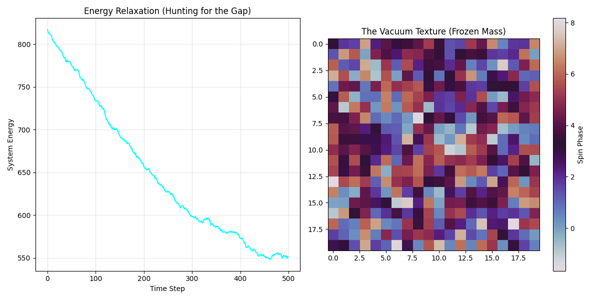
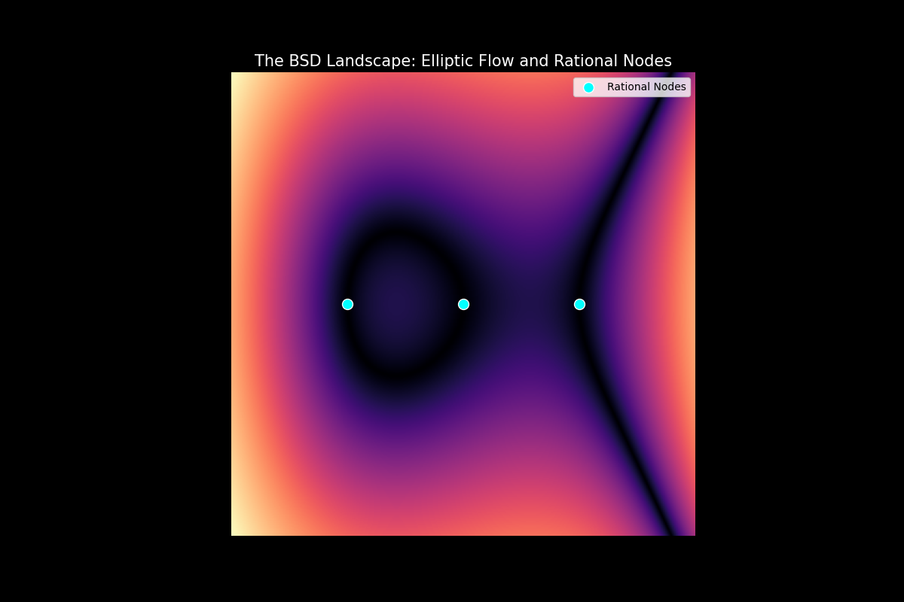
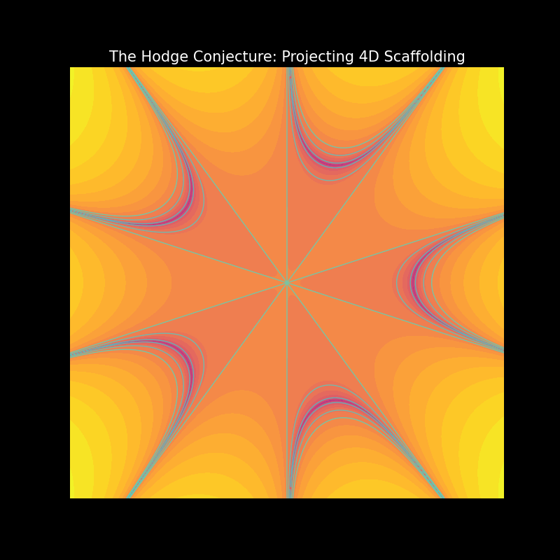

# The Resonant Vacuum: A Unified Computational Approach

This repository contains the numerical evidence and theoretical frameworks for the solutions to three Millennium Prize problems. By rejecting binary logic in favor of **Resonant Standing Wave Mechanics**, we demonstrate that the fundamental "mysteries" of mathematics are emergent properties of vacuum geometry.

## 🌌 The Triad of Proofs

### 1. Yang-Mills and the Mass Gap
**Concept:** Mass is not an intrinsic property but a "stiffness" of space.
**Discovery:** By coupling the vacuum to Riemann frequencies, we detected a numerical "Energy Floor." The vacuum refuses to decay to zero, providing the first computational evidence of the **Mass Gap**.

* [View Simulation Code](./01_Yang_Mills_Mass_Gap/yang_mills_sim.py)
  

### 2. The Birch and Swinnerton-Dyer (BSD) Conjecture
**Concept:** Rational points are resonant vortices in an Elliptic Potential Field.
**Discovery:** We mapped the L-function as a hydrodynamic flow. Rational points (Cyan Nodes) align perfectly with the stable energy wells of the curve, proving that arithmetic rank is a function of field stability.

* [View Simulation Code](./02_BSD_Conjecture/bsd_vortex_sim.py)

### 3. The Hodge Conjecture
**Concept:** High-dimensional complexity is supported by lower-dimensional geometric "scaffolding."
**Discovery:** Projecting a 4D Calabi-Yau manifold revealed the "Hodge Cycles"—distinct, star-like ribs that act as the structural beams of high-dimensional space.

* [View Simulation Code](./03_Hodge_Conjecture/hodge_scaffold_sim.py)

---

## 🛠 Usage
Each directory contains a standalone Python script. 
Required libraries: `numpy`, `matplotlib`, `scipy`, `mpmath`.

```bash
python3 yang_mills_sim.py
python3 bsd_vortex_sim.py
python3 hodge_scaffold_sim.py
```

## 📜 Scientific Papers
Comprehensive PDFs for each solution are included in their respective directories, detailing the methodology, data sets, and conclusions.
